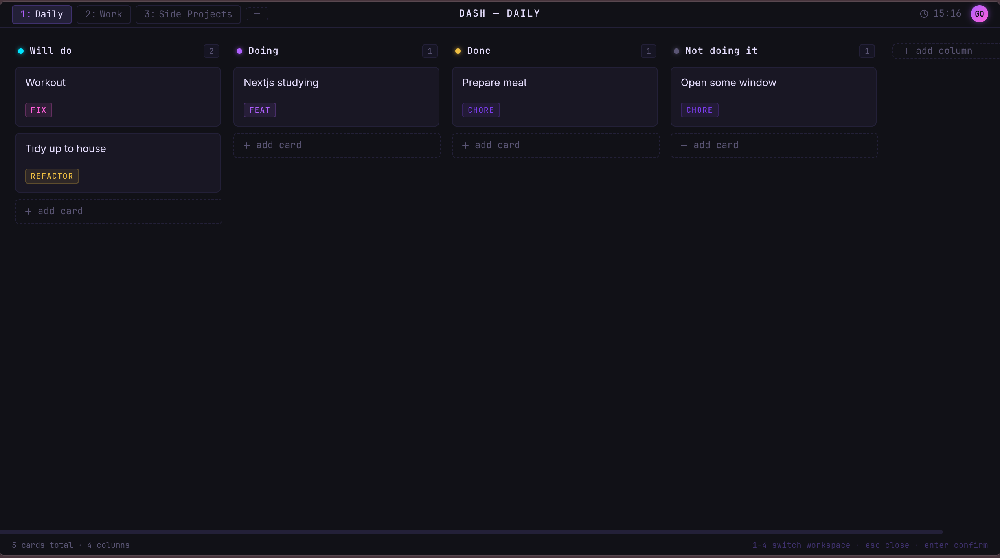

# Dashboard Todo

A personal Kanban-style todo app inspired by Linux virtual workspaces. Switch between isolated workspaces, each containing its own Kanban board with columns and cards — just like flipping between virtual desktops on a tiling window manager.

Live at: **dash.gorkemkaryol.dev**



## Concept

Each **workspace** is an independent Kanban board. You can have a `Work` workspace, a `Personal` workspace, a `Side Projects` workspace, and jump between them the same way you jump between Linux virtual desktops. Within each workspace you organize tasks into **columns** (e.g. To Do, In Progress, Done) and track them as **cards**.

```
Workspace: Work          Workspace: Personal
┌──────────┬──────────┐  ┌──────────┬──────────┐
│  To Do   │   Done   │  │  To Do   │  Doing   │
│──────────│──────────│  │──────────│──────────│
│ Fix bug  │ PR #42   │  │ Read     │ Exercise │
│ Write    │ Deploy   │  │ Groceries│          │
│ tests    │          │  │          │          │
└──────────┴──────────┘  └──────────┴──────────┘
```

## Tech Stack

| Layer      | Technology                                        |
|------------|---------------------------------------------------|
| Frontend   | React 19, Vite, TanStack Router, TanStack Query   |
| Backend    | NestJS 11, TypeScript                             |
| Database   | Neon PostgreSQL via Prisma 7 ORM                  |
| Auth       | JWT in httpOnly cookie, bcrypt password hashing   |
| Deploy     | Render (API), Cloudflare Pages (frontend)         |

## Project Structure

```
Dashboard-Todo/
├── api/
│   ├── src/
│   │   ├── config/               # app, database, jwt config
│   │   ├── common/
│   │   │   ├── guards/           # AuthGuard (cookie → JWT verify → req.user)
│   │   │   ├── decorators/       # @CurrentUser() param decorator
│   │   │   ├── filters/          # HTTP exception filter
│   │   │   └── types/            # Express Request type augmentation
│   │   ├── infrastructure/
│   │   │   └── database/prisma/  # PrismaModule (global) + PrismaService
│   │   └── modules/
│   │       ├── auth/             # register, login, logout, me
│   │       ├── workspaces/       # workspace CRUD
│   │       ├── columns/          # column CRUD
│   │       └── cards/            # card CRUD + move
│   └── prisma/
│       └── schema.prisma
└── web/
    └── src/
        ├── routes/               # thin file-based route wrappers (TanStack Router)
        │   ├── __root.tsx
        │   ├── index.tsx         # redirects to /dashboard
        │   ├── login.tsx
        │   ├── register.tsx
        │   └── _auth/            # authenticated layout (GET /auth/me guard)
        │       ├── route.tsx
        │       ├── dashboard.tsx
        │       └── settings.tsx
        ├── features/             # all UI and business logic
        │   ├── auth/             # LoginPage, RegisterPage
        │   ├── board/            # Board, Column, KanbanCard, modals, TopBar, DashboardPage
        │   └── settings/         # SettingsPage
        ├── api/                  # fetch client + TypeScript types
        └── lib/                  # shared utilities (cn)
```

## Database Schema

```
User         Workspace        Column           Card
──────────   ─────────────    ──────────────   ─────────────
id (PK)      id (PK)          id (PK)          id (PK)
email (UQ)   userId (FK) ──→  workspaceId(FK)  columnId (FK)
passwordHash name             name             title
createdAt    description?     color            tag?
             color            position         tagColor?
             position         createdAt        position
             createdAt                         createdAt
                                               updatedAt
```

All foreign keys use `onDelete: Cascade` — deleting a user removes everything; deleting a workspace removes its columns and cards.

## Getting Started

### Prerequisites

- Node.js 20+
- PostgreSQL (local or [Neon](https://neon.tech) hosted)

### API

```bash
cd api
npm install
cp .env.example .env   # fill in your values
npx prisma migrate dev
npm run start:dev
```

API runs at `http://localhost:3000`.

### Web

```bash
cd web
npm install
cp .env.example .env   # set VITE_API_URL=http://localhost:3000
npm run dev
```

App runs at `http://localhost:5173`.

## API Reference

All routes marked 🔒 require the JWT cookie (set by `POST /auth/login`).

### Auth
| Method | Path             | Description                               |
|--------|------------------|-------------------------------------------|
| POST   | /auth/register   | Create account (email + password)         |
| POST   | /auth/login      | Set httpOnly JWT cookie                   |
| POST   | /auth/logout     | Clear cookie                              |
| GET    | /auth/me         | Current user info 🔒                      |
| GET    | /health          | Uptime check — returns `{ status: 'ok' }` |

### Workspaces 🔒
| Method | Path               | Description                               |
|--------|--------------------|-------------------------------------------|
| GET    | /workspaces        | All workspaces, ordered by position       |
| POST   | /workspaces        | Create workspace                          |
| GET    | /workspaces/:id    | Workspace + columns + cards (nested)      |
| PATCH  | /workspaces/:id    | Update name, color, description           |
| DELETE | /workspaces/:id    | Delete (cascades columns and cards)       |

### Columns 🔒
| Method | Path                        | Description                    |
|--------|-----------------------------|--------------------------------|
| GET    | /columns?workspaceId=xxx    | Columns for a workspace        |
| POST   | /columns                    | Create column                  |
| PATCH  | /columns/:id                | Update name, color             |
| DELETE | /columns/:id                | Delete (cascades cards)        |

### Cards 🔒
| Method | Path                  | Description                                |
|--------|-----------------------|--------------------------------------------|
| GET    | /cards?columnId=xxx   | Cards in a column, ordered by position     |
| POST   | /cards                | Create card                                |
| PATCH  | /cards/:id            | Update title, tag                          |
| PATCH  | /cards/:id/move       | Move card — body: `{ columnId, position }` |
| DELETE | /cards/:id            | Delete card                                |

## Environment Variables

### API (`api/.env`)

| Variable         | Description                                            |
|------------------|--------------------------------------------------------|
| `DATABASE_URL`   | PostgreSQL connection string                           |
| `JWT_SECRET`     | Secret for signing JWT tokens                          |
| `JWT_EXPIRES_IN` | Token lifetime (e.g. `7d`, `24h`)                     |
| `FRONTEND_URL`   | Allowed CORS origin (e.g. `https://dash.yourdomain.dev`) |
| `NODE_ENV`       | `development` or `production`                          |
| `PORT`           | Server port (Render sets this automatically)           |

See [`api/.env.example`](api/.env.example).

### Web (`web/.env`)

| Variable        | Description                          |
|-----------------|--------------------------------------|
| `VITE_API_URL`  | Backend URL (no trailing slash)      |

Local: `http://localhost:3000` — Production: your Render service URL or custom API domain.

## Deployment

| Service            | Role                | Notes                                          |
|--------------------|---------------------|------------------------------------------------|
| Render             | Backend API         | Free tier; Uptime Robot keeps it awake         |
| Cloudflare Pages   | Frontend static     | Custom domain via Cloudflare DNS               |
| Neon               | PostgreSQL          | Serverless Postgres                            |
| Uptime Robot       | Health pings        | Hits `GET /health` every 5 minutes             |

**Cookie architecture:** For the auth cookie to work cross-origin, the API and frontend should share the same registrable domain (e.g. `api.yourdomain.dev` and `dash.yourdomain.dev`). This allows `sameSite: 'lax'` instead of `sameSite: 'none'`, avoiding modern browser third-party cookie restrictions. If they're on completely different domains, browsers will block the cookie.

**Production build:** The API build script runs `prisma generate && npx @nestjs/cli build`. Prisma client must be generated before TypeScript compilation — without it `@prisma/client` exports nothing.

## Scripts

### API

| Command                | Description                            |
|------------------------|----------------------------------------|
| `npm run start:dev`    | Dev server with hot reload             |
| `npm run start:prod`   | Run compiled production build          |
| `npm run build`        | `prisma generate` + compile TypeScript |
| `npm run test`         | Unit tests                             |
| `npm run test:e2e`     | End-to-end tests                       |
| `npm run lint`         | ESLint with auto-fix                   |
| `npm run format`       | Prettier format                        |

### Web

| Command           | Description                     |
|-------------------|---------------------------------|
| `npm run dev`     | Start Vite dev server           |
| `npm run build`   | Type-check and production build |
| `npm run preview` | Preview the production build    |
| `npm run lint`    | ESLint check                    |

## License

[MIT](LICENSE) — Copyright (c) 2026 Görkem Karyol
